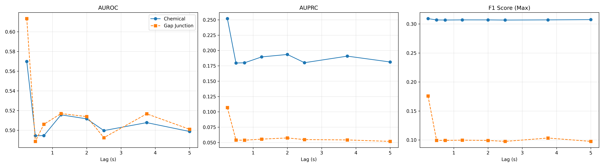
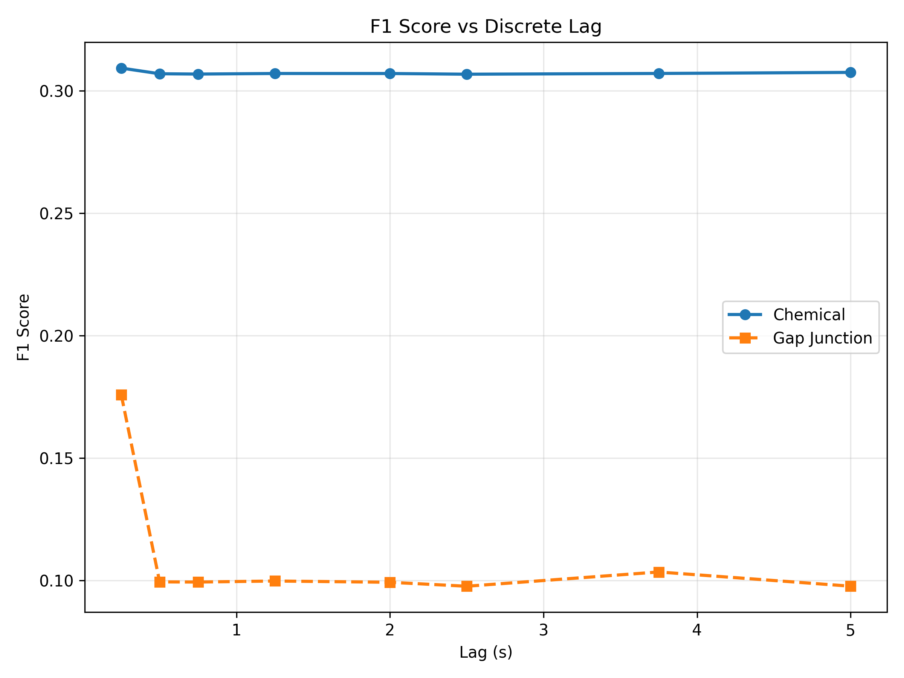

# Chemical vs Gap Junction Performance Analysis

We analyzed the performance of the SBTG model in recovering Chemical Synapses versus Gap Junctions (Electrical Synapses) across different time lags.

## Key Findings

### 1. Gap Junctions are better predicted at short lags (AUROC)

At Lag 1 (0.25s), SBTG recovers Gap Junctions with significantly higher accuracy than Chemical Synapses in terms of rank ordering (AUROC):

- **Gap Junction AUROC**: **0.613**
- **Chemical Synapse AUROC**: **0.570**

This result is biologically consistent: electrical synapses (gap junctions) allow for ultra-fast, bidirectional current flow, which dominates the immediate frame-to-frame (250ms) covariance structure captured by SBTG at Lag 1.

### 2. Chemical Synapses show higher Precision/Recall Baseline

Despite lower AUROC, Chemical Synapses show higher AUPRC (0.252 vs 0.107) and F1 (0.309 vs 0.176). This likely reflects the higher density of the chemical connectome compared to the sparser gap junction network, making "random" positive predictions more likely to be correct (higher baseline precision).

### 3. Fast Decay of Structural Signal

Both structural signals decay rapidly. By Lag 2 (0.50s), prediction performance for both connectomes drops to near chance (~0.50). This suggests that direct structural connections (both electrical and chemical) primarily drive the _immediate_ next-step dynamics in this dataset.

## Detailed Results

| Lag | Time (s) | Chem AUROC | Gap AUROC | Chem AUPRC | Gap AUPRC | Chem F1 (Max) | Gap F1 (Max) |
| --- | -------- | ---------- | --------- | ---------- | --------- | ------------- | ------------ |
| 1   | 0.25     | 0.570      | **0.613** | 0.252      | 0.107     | 0.309         | 0.176        |
| 2   | 0.50     | 0.494      | 0.489     | 0.180      | 0.054     | 0.307         | 0.099        |
| 3   | 0.75     | 0.495      | 0.506     | 0.180      | 0.054     | 0.307         | 0.099        |
| 5   | 1.25     | 0.516      | 0.517     | 0.190      | 0.055     | 0.307         | 0.100        |
| 8   | 2.00     | 0.512      | 0.514     | 0.193      | 0.057     | 0.307         | 0.099        |
| 10  | 2.50     | 0.500      | 0.492     | 0.180      | 0.055     | 0.307         | 0.098        |
| 15  | 3.75     | 0.508      | 0.517     | 0.191      | 0.054     | 0.307         | 0.103        |
| 20  | 5.00     | 0.499      | 0.501     | 0.181      | 0.052     | 0.308         | 0.098        |

## Figures

### Performance Overview (AUROC, AUPRC, F1)

### F1 Score (Dedicated)

